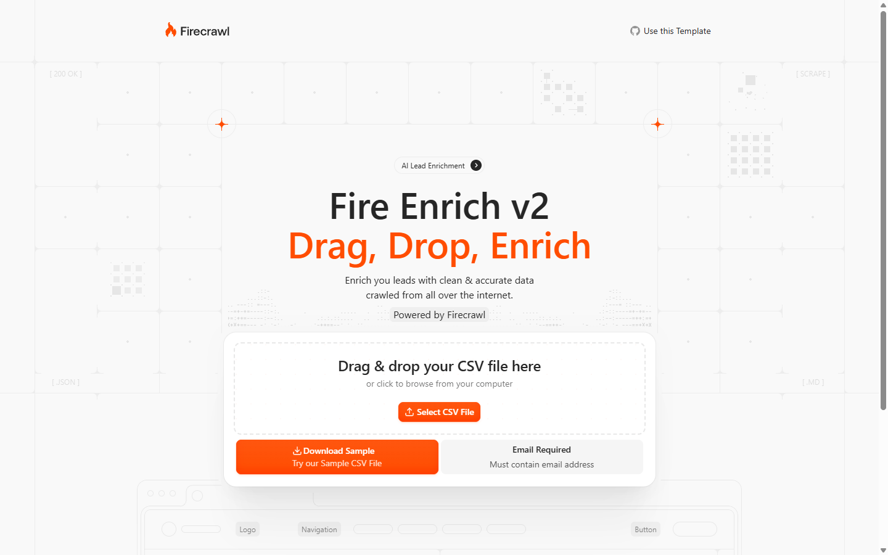
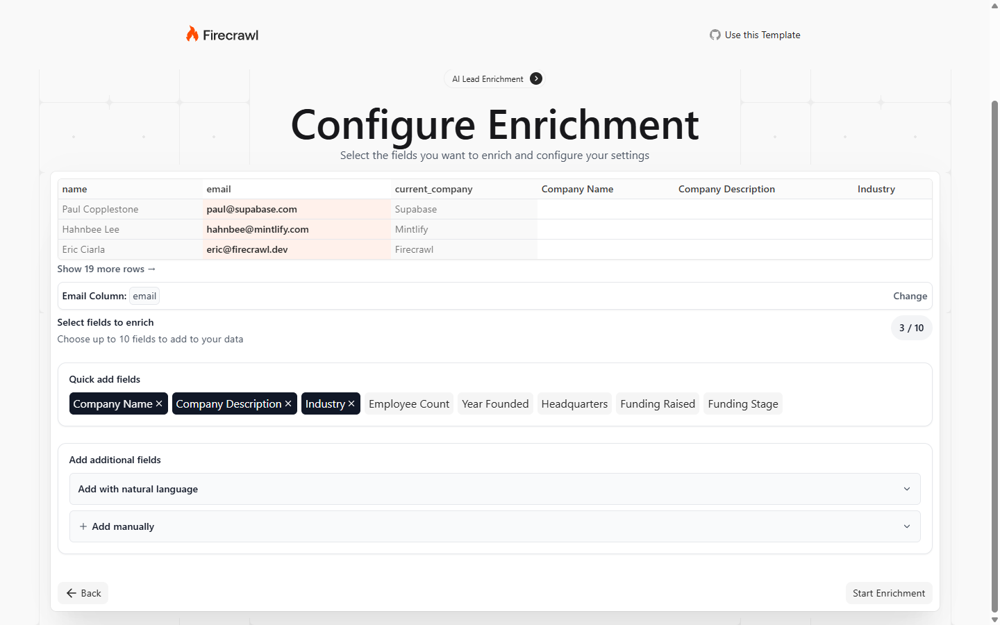
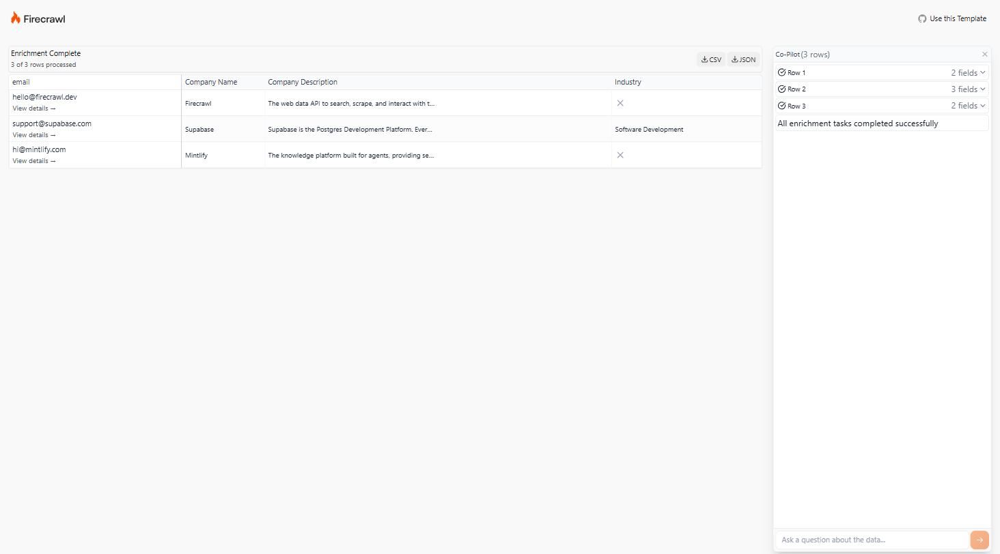

# Fire Enrich

Fire Enrich adds company data to a CSV of contact emails. Each row is researched on the web with [Firecrawl](https://www.firecrawl.dev/) by [Mastra](https://mastra.ai/) agents, and every value it fills in carries the source page and the quote that supports it.

This repository is a fork of [firecrawl/fire-enrich](https://github.com/firecrawl/fire-enrich) with the enrichment engine replaced by Mastra workflows and agents.

- [What it does](#what-it-does)
- [Accounts and keys](#accounts-and-keys)
- [Environment variables](#environment-variables)
- [Deploy with Vercel](#deploy-with-vercel)
- [Local development](#local-development)
- [Dolt setup (optional)](#dolt-setup-optional)
- [Screenshots](#screenshots)
- [Credits and license](#credits-and-license)

## What it does

1. **Upload** a CSV with an email column. The column is detected automatically and can be changed. Rows with a personal email address (Gmail, Yahoo and similar providers) are skipped.
2. **Choose fields.** Pick from preset fields such as company name, industry, employee count or funding stage, describe more in natural language, or add them manually. A run takes 1 to 10 fields.
3. **Enrich.** Each row runs the `enrichRow` workflow (`lib/mastra/workflows/enrich-row.ts`):
   1. **Plan**: the planner turns the requested fields into a research plan: groups of fields, the searches and sources to try for each, and a strategy per group (search, Firecrawl's hosted agent, or a hosted browser). The plan is cached per field set.
   2. **Identify**: an agent reads the site on the email's domain to establish the company, its website and a short description.
   3. **Research**: one research agent per group fills its fields with the Firecrawl search, scrape and map tools, and reports each value with the page quote that supports it. A value without supporting evidence is left unknown.
4. **Review.** Results stream into the table row by row. Each cell links to its source. The table exports to CSV or JSON.
5. **Ask.** The chat panel sends questions to the `chat` agent (`lib/mastra/agents/chat.ts`). It answers from the enriched table when the table holds the answer, and otherwise searches the web and cites the page it read.

Model calls go through the [Vercel AI Gateway](https://vercel.com/docs/ai-gateway). The default models are set per role in `lib/mastra/models.ts`.

With [Dolt](#dolt-setup-optional) configured, each run is also recorded as a versioned commit, and the results show what changed since the previous run of the same list.

## Accounts and keys

| Service | Required | Used for | Where to get the key |
| --- | --- | --- | --- |
| [Firecrawl](https://www.firecrawl.dev/) | Yes | Web search, scraping, the hosted agent and the hosted browser | [firecrawl.dev/app/api-keys](https://www.firecrawl.dev/app/api-keys) |
| [Vercel](https://vercel.com/) | Yes | Hosting, and the AI Gateway for every model call | On Vercel the deployment's OIDC token authenticates the gateway, so no key is needed. For local development, create an AI Gateway API key in the Vercel dashboard ([AI Gateway authentication](https://vercel.com/docs/ai-gateway/authentication)), or run `vercel env pull` in a linked project. |
| [Turso](https://turso.tech/) | Yes on Vercel, optional locally | Mastra's workflow state, business profiles and saved research plans | The Turso integration on the [Vercel Marketplace](https://vercel.com/marketplace/tursocloud) sets both variables. With the [Turso CLI](https://docs.turso.tech/cli/introduction): `turso db create <database>`, then `turso db show <database> --url` and `turso db tokens create <database>`. Without Turso, a local run uses a SQLite file at `.mastra/fire-enrich.db`. |
| [Dolt](https://www.dolthub.com/) | No | Versioned run history and run-to-run diffs | A local or self-hosted `dolt sql-server`, or [Hosted Dolt](https://hosted.doltdb.com). See [docs/dolt-setup.md](docs/dolt-setup.md). |
| [Upstash](https://upstash.com/) | No | Rate limiting of `/api/scrape` | The REST URL and token of a Redis database in the [Upstash console](https://console.upstash.com/), or the Upstash integration on the Vercel Marketplace, which sets `KV_REST_API_URL` and `KV_REST_API_TOKEN`. |

## Environment variables

`.env.example` explains each variable that is set by hand. The variables the platform sets and the test-only variables are listed in the tables below. Copy `.env.example` to `.env.local` for local development.

### Required

| Variable | Description |
| --- | --- |
| `FIRECRAWL_API_KEY` | Firecrawl API key. The search, scrape, map, agent and browser tools all use it. |
| `AI_GATEWAY_API_KEY` | AI Gateway key. Required locally, unless `VERCEL_OIDC_TOKEN` is set (see below). Not needed on Vercel, where the deployment's OIDC token authenticates the gateway. |
| `TURSO_DATABASE_URL` | Turso database URL (`libsql://…`). Required on Vercel, because serverless instances share no disk. Locally, leave it and `TURSO_AUTH_TOKEN` unset to use `.mastra/fire-enrich.db`. |
| `TURSO_AUTH_TOKEN` | Turso auth token. Set it together with `TURSO_DATABASE_URL`. |

The Turso integration on the Vercel Marketplace sets `TURSO_DATABASE_URL` and `TURSO_AUTH_TOKEN`. When it is connected with a custom prefix, it sets `<PREFIX>_TURSO_DATABASE_URL` and `<PREFIX>_TURSO_AUTH_TOKEN` instead, and the app reads that pair. `TURSO_DATABASE_URL` wins when both are set. A half pair, a pair that mixes the two namings, a token without a URL, or two complete `<PREFIX>_TURSO_*` pairs without `TURSO_DATABASE_URL` is an error: the Vercel build fails before building, and the app throws, each naming the variables.

Do not point a local `.env.local` at the production Turso database: local runs create the app's tables on first use.

### Optional

| Variable | Default | Description |
| --- | --- | --- |
| `FIRECRAWL_API_URL` | `https://api.firecrawl.dev` | Firecrawl API origin, for a self-hosted Firecrawl. |
| `EVIDENCE_CHECK` | on | A second evidence check: an evaluation model (`typesafe-ai/jev` on the AI Gateway) scores whether each finding's quote supports its value. `0` or `false` turns it off. The AI SDK evaluation API it uses is experimental. |
| `EVIDENCE_CHECK_THRESHOLD` | `0.5` | Score, from 0 to 1, a finding needs to be kept by the evidence check. A finding below it is left unknown. |
| `DEFAULT_PROFILE_ID` | newest profile | Business profile the planner uses when a request names none. Profiles are created with `POST /api/profiles`. With no profiles, the planner uses a generic one. |
| `LIBSQL_PREVIEW_MIGRATE` | unset | `1` also creates the app's Turso tables on Vercel Preview builds. Set it only when Preview uses a different Turso database from Production. |
| `UPSTASH_REDIS_REST_URL` | unset | With `UPSTASH_REDIS_REST_TOKEN`, limits each IP to 50 `/api/scrape` requests a day. Unset: no rate limiting. |
| `UPSTASH_REDIS_REST_TOKEN` | unset | Token for `UPSTASH_REDIS_REST_URL`. |
| `KV_REST_API_URL` | unset | Same as `UPSTASH_REDIS_REST_URL`, under the name the Vercel Upstash integration sets. A pair that mixes the two namings does not count. |
| `KV_REST_API_TOKEN` | unset | Token for `KV_REST_API_URL`. |

### Optional: Dolt run history

Dolt is off while no `DOLT_*` connection variable is set. `DOLT_HOST` and `DOLT_DATABASE` turn it on. When some connection variables are set but either of those two is missing, the build and the migration scripts fail and name the missing variables. [docs/dolt-setup.md](docs/dolt-setup.md) covers each value.

| Variable | Default | Description |
| --- | --- | --- |
| `DOLT_HOST` | unset | Dolt SQL server host. |
| `DOLT_DATABASE` | unset | Database name. |
| `DOLT_PORT` | `3306` | Server port. |
| `DOLT_USER` | `root` | User name. |
| `DOLT_PASSWORD` | empty | Password. |
| `DOLT_TLS_CA_B64` | unset | Base64 of the server's CA certificate, for a server that requires TLS with a self-signed certificate. |
| `DOLT_COMMIT_AUTHOR` | `Fire Enrich <fire-enrich@localhost>` | Author of the commit each run ends in, as `Name <email>`. |
| `DOLT_PREVIEW_MIGRATE` | unset | `1` also applies the Dolt schema on Vercel Preview builds. Set it only when Preview uses a different database from Production. |

### Set by the platform

These are read by the code but not set by hand.

| Variable | Set by | Description |
| --- | --- | --- |
| `VERCEL` | Vercel | Marks a Vercel runtime. The local SQLite fallback is refused there, and the app does not create tables at runtime. |
| `VERCEL_ENV` | Vercel | `production` or `preview`. Decides whether the build runs the database migrations. |
| `VERCEL_OIDC_TOKEN` | `vercel env pull` | Authenticates the AI Gateway in local development, in place of `AI_GATEWAY_API_KEY`. |
| `NODE_ENV` | Next.js | Build mode. |

`FIRE_ENRICH_UNLIMITED` is set in `.env.example` and read by `app/fire-enrich/config.ts`, but no code applies the limits in that file, so it has no effect.

### Tests only

Set by `tests/setup.ts`, the npm scripts or CI. A real run never needs them.

| Variable | Description |
| --- | --- |
| `USE_AIMOCK` | `true` serves every model call from `fixtures/*.json` through AIMock instead of the gateway. |
| `AIMOCK_URL` | AIMock server address. Default `http://127.0.0.1:4010`. |
| `AIMOCK_MODEL` | Model id sent to AIMock. Default `gpt-4o-mini`. |
| `OPENAI_API_KEY`, `OPENAI_BASE_URL` | Set by the AIMock setup to point the OpenAI provider at AIMock. |
| `MASTRA_TELEMETRY_DISABLED` | Turns off Mastra telemetry in tests. |
| `DOLT_TEST_HOST`, `DOLT_TEST_PORT`, `DOLT_TEST_USER`, `DOLT_TEST_PASSWORD`, `DOLT_TEST_DATABASE` | Throwaway Dolt server for `tests/dolt/migrate.live.test.ts`. The test is skipped unless host and database are set. Never point them at a database whose data matters. |
| `E2E_SKIP_BUILD` | `1` makes `npm run test:e2e` use the existing build. |
| `CI` | Makes Playwright fail on `test.only`. |

## Deploy with Vercel

A deployment needs a Firecrawl API key and a Turso database. The Turso database holds business profiles, saved research plans and Mastra's workflow state. The AI Gateway needs no key on Vercel: the deployment's OIDC token authenticates it. Dolt (run history) is optional, and neither button asks for it.

The two buttons differ only in where the Turso database comes from.

**Turso from the Vercel Marketplace.** The Turso Cloud integration creates a database, or connects one it already manages in your Vercel team, and sets `TURSO_DATABASE_URL` and `TURSO_AUTH_TOKEN` on the project. The button asks for `FIRECRAWL_API_KEY` only. If the connection is given a custom prefix, the integration sets `<PREFIX>_TURSO_DATABASE_URL` and `<PREFIX>_TURSO_AUTH_TOKEN`, and the app reads that pair too.

[](https://vercel.com/new/clone?repository-url=https%3A%2F%2Fgithub.com%2Fhamchowderr%2Ffire-enrich&project-name=fire-enrich&repository-name=fire-enrich&env=FIRECRAWL_API_KEY&envDescription=Your%20Firecrawl%20API%20key.%20The%20Turso%20integration%20on%20this%20page%20provides%20the%20database.&envLink=https%3A%2F%2Fgithub.com%2Fhamchowderr%2Ffire-enrich%23deploy-with-vercel&stores=%5B%7B%22type%22%3A%22integration%22%2C%22integrationSlug%22%3A%22tursocloud%22%2C%22productSlug%22%3A%22database%22%2C%22protocol%22%3A%22storage%22%2C%22allowConnectExistingProduct%22%3Atrue%7D%5D)

**Your own Turso database.** For a database in an existing Turso account. The button asks for `FIRECRAWL_API_KEY`, `TURSO_DATABASE_URL` and `TURSO_AUTH_TOKEN`. `turso db show <database> --url` prints the url, and `turso db tokens create <database>` creates a token.

[](https://vercel.com/new/clone?repository-url=https%3A%2F%2Fgithub.com%2Fhamchowderr%2Ffire-enrich&project-name=fire-enrich&repository-name=fire-enrich&env=FIRECRAWL_API_KEY,TURSO_DATABASE_URL,TURSO_AUTH_TOKEN&envDescription=Your%20Firecrawl%20API%20key%2C%20and%20the%20database%20url%20and%20auth%20token%20of%20your%20own%20Turso%20database.&envLink=https%3A%2F%2Fgithub.com%2Fhamchowderr%2Ffire-enrich%23deploy-with-vercel)

The production build creates the app's tables in the Turso database before the deployment serves traffic.

After the first deploy, enrichment works with the required services only. To add run history, set the Dolt variables on the project and redeploy (see [Dolt setup](#dolt-setup-optional)). Vercel reads environment variables at build time, so every variable change needs a redeploy.

## Local development

Requirements: Node.js 24 and npm.

1. Clone the repository and install dependencies:
   ```sh
   git clone https://github.com/hamchowderr/fire-enrich.git
   cd fire-enrich
   npm install
   ```
2. Copy the example environment file:
   ```sh
   cp .env.example .env.local
   ```
3. In `.env.local`, set `FIRECRAWL_API_KEY` and `AI_GATEWAY_API_KEY`. Leave the Turso and Dolt variables commented out to use the local SQLite file and run without run history.
4. Start the development server:
   ```sh
   npm run dev
   ```
5. Open [http://localhost:3000](http://localhost:3000). The upload page links a sample CSV (`public/sample-data.csv`).

`npm run studio` starts [Mastra Studio](https://mastra.ai/docs) on the agents and workflows in `lib/mastra`.

The build, test and lint commands, the test harness, and the rules for database schema changes are in [CLAUDE.md](CLAUDE.md). `npm run check` runs what CI runs.

## Dolt setup (optional)

Dolt adds versioned run history: each enrichment run is recorded with its values and evidence, ends in one Dolt commit, and `GET /api/runs/:id/diff` compares it with the previous run of the same list. Without Dolt, runs still stream and are not recorded, and `GET /api/runs/:id/diff` answers `501`.

[docs/dolt-setup.md](docs/dolt-setup.md) covers:

- [Local development](docs/dolt-setup.md#local-development) with Docker or the `dolt` binary.
- [A self-hosted server](docs/dolt-setup.md#your-own-server-vps) with TLS, and the Vercel variables that connect to it.
- [Hosted Dolt](docs/dolt-setup.md#managed-alternative) as a managed option.

After the variables are set, `npm run db:migrate` applies the schema. A production build on Vercel runs the same migration.

## Screenshots

Upload:



Field configuration:



Results:



✕ marks a field for which no value was found.

## Credits and license

Fire Enrich was created by [Firecrawl](https://www.firecrawl.dev/) as [firecrawl/fire-enrich](https://github.com/firecrawl/fire-enrich) and is released under the MIT License. This fork keeps that license. See [LICENSE](LICENSE).

Issues and pull requests are welcome in this repository.
